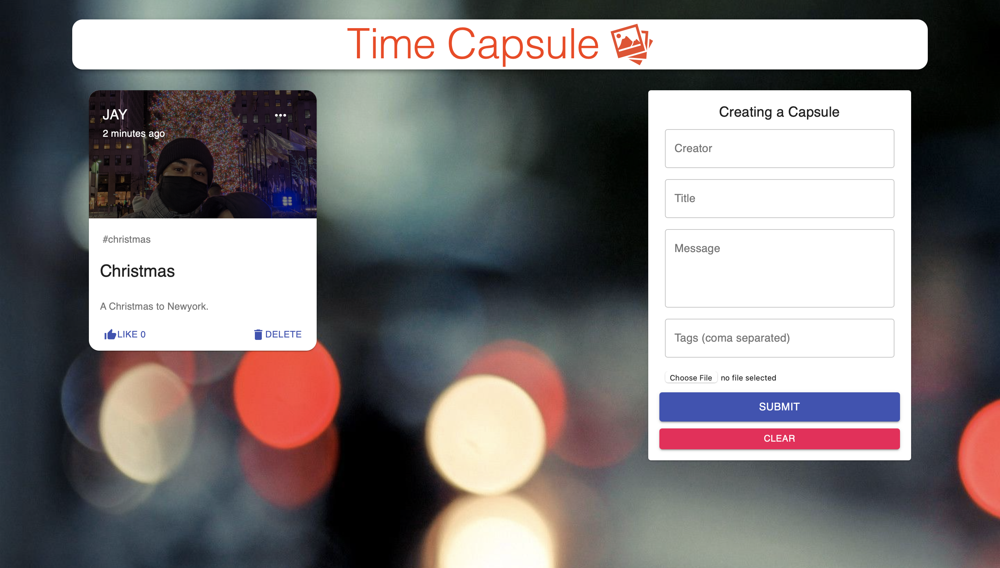

# Time Capsule
Time Capsule is a photo memory storage app which allows people to store their significant days to remember by with a title, message and hashtags.

## Features
 - Time Capsule provides the ability to organize digital memory collection in its Gallery view, by adding titles, captions, and custom metadata tags to photos.
 - It allows the user to add update and delete a post.
 - Adding a personalize messages.
 - Attaching Pics to memories.

 ## Overview
 

## Demo Video
https://youtu.be/LftMNSaEuhs

## Technologies

Front-End

- [ ] HTML5
- [ ] CSS3/Grid
- [ ] React.js
- [ ] axios
- [ ] Moment
- [ ] Material UI

Back-End

- [ ] Node.js
- [ ] Express.js
- [ ] Body Parser
- [ ] mongoose
- [ ] cors
- [ ] nodemon

## Application Requirements

* Must use ReactJS in some way

* Must use a Node and Express Web Server

* Must be backed by a MySQL or MongoDB database with a Sequelize or Mongoose ORM

* Must have both GET and POST routes for retrieving and adding new data

* Must utilize at least 2 libraries, packages, or technologies that we haven't discussed

* Must allow for or involve the authentication of users in some way

* Must have a polished front end/UI

* Must have a folder structure that meets the MVC paradigm

* Must meet good quality coding standards (indentation, scoping, naming)

* Must protect API keys in Node with environment variables

## Authors

Japkirat Singh

- [GitHub](https://github.com/JAPKIRAT96)
- [LinkedIn](https://www.linkedin.com/in/japkirat-singh-7831b81b1/)

## License

This project is licensed under the ISC License.
